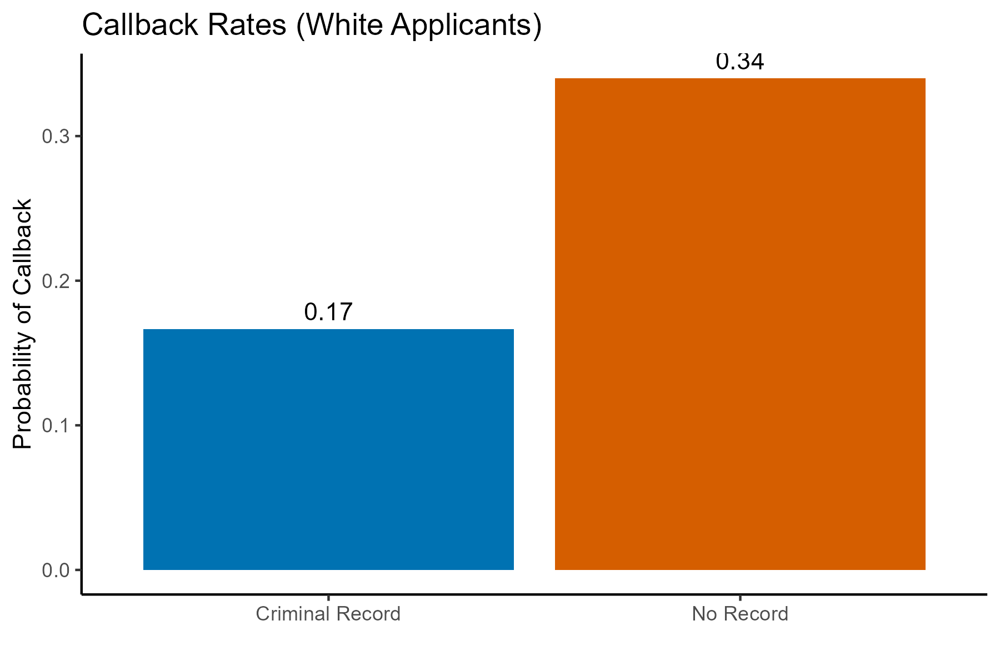
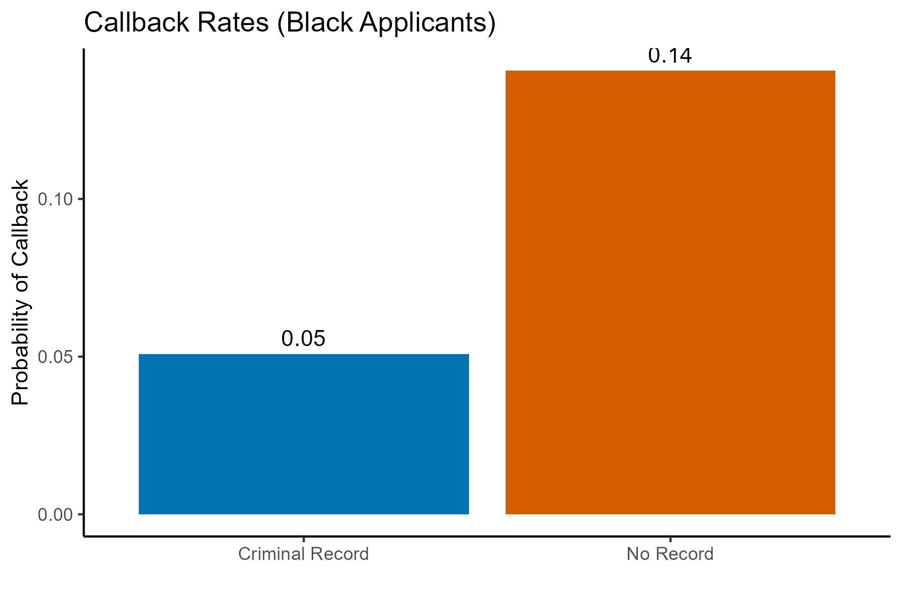

# Labor Market Discrimination: Criminal Record Audit Study

## Overview

This project analyzes data from a randomized audit experiment to estimate the causal effect of having a criminal record on the probability of receiving a callback for a job interview. The study is based on a field experiment conducted in Milwaukee, where matched applicants differed only in their criminal record status.

This project contributes to a broader research agenda on inequality and discrimination, focusing on how social characteristics affect access to economic opportunities.

## Research Question

Does having a criminal record reduce the likelihood of receiving a callback from employers?

## Data
- Unit of observation: individual job applications
- Key variables:
    - `criminal`: treatment indicator (1 = criminal record, 0 = no record)
    - `call`: outcome variable (1 = callback received, 0 = no callback)
    - `race`: applicant race (white or black)

The original dataset is not included in this repository due to usage restrictions.

A simulated dataset (`simulated_applications.csv`) is included for reproducibility. 
It mirrors the structure of the original data but does not reproduce the original observations.

## Methodology

The analysis exploits the randomized audit design to estimate the causal effect of a criminal record on employer callbacks.

Because criminal record status is randomly assigned, treatment is independent of both observed and unobserved characteristics. This allows the difference in average callback rates between treated and control groups to be interpreted as the **average treatment effect (ATE)**.

Methods used:

- Difference-in-means estimator
- Linear regression (equivalent to difference-in-means)
- Subgroup analysis by race
- Statistical inference using hypothesis testing and p-values

## Empirical Results
**White applicants:**
- Callback rate (no criminal record): ~34%
- Callback rate (criminal record): ~17%
- Estimated effect: **−17 percentage points**

**Black applicants:**
- Callback rate (no criminal record): ~14%
- Callback rate (criminal record): ~5%
- Estimated effect: **−9 percentage points**

Having a criminal record significantly reduces callback rates for both groups. The estimated effect is larger in magnitude among white applicants than among black applicants.

## Visualizations

### Callback rates of White applicants


### Callback rates of Black applicants


## Interpretation

- **Internal validity:** Strong. Random assignment ensures that treatment is independent of potential outcomes, supporting a causal interpretation of the estimated effects.
- **External validity:** Limited. The study focuses on low-wage job applications in Milwaukee in the early 2000s. Results may generalize to similar labor markets but not necessarily to different contexts or time periods.
- These results highlight how randomized experimental designs can uncover causal effects that would be difficult to identify using observational data alone.

## Ethical Considerations

This analysis is based on an audit experiment designed to detect discrimination in hiring. While such experiments provide strong causal evidence, they also raise important ethical considerations.

- **Use of deception:** Audit studies involve presenting fictitious job applications, which may impose costs on employers without their consent. This raises questions about the balance between research value and the burden placed on participants.
- **Fairness and discrimination:** The findings highlight systematic disadvantages faced by individuals with criminal records. Care must be taken in interpreting these results to avoid reinforcing stigmatization, while still acknowledging structural inequalities in the labor market.
- **Data limitations and responsible interpretation:** The dataset reflects a specific historical and geographic context. Overgeneralizing results beyond this setting could lead to misleading conclusions about broader populations.
- **Implications for automated decision-making:** The observed patterns of discrimination are relevant for modern algorithmic hiring systems. If historical data reflecting biased outcomes are used to train models, similar disparities may be reproduced or amplified. This underscores the importance of fairness-aware modeling and critical evaluation of training data.


## Limitations

- The study is based on low-wage job applications in Milwaukee during the early 2000s. Results may not generalize to other labor markets, occupations, or time periods.
- Callback rates measure initial employer interest but do not capture full hiring decisions or long-term employment outcomes.
- While audit experiments provide strong internal validity, they rely on fictitious applications, which may not fully reflect real applicant behavior or employer interactions.
- Employer behavior observed in this setting may differ from that in other institutional, legal, or economic environments.
- The use of deception in audit studies raises ethical considerations regarding the burden placed on employers, even though it is justified by the scientific value of identifying discrimination.


## Reproducibility

This project is fully reproducible using:

- `analysis.R` → full empirical workflow  
- `simulate_data.R` → synthetic data generation  

To reproduce results:

```r
source("simulate_data.R")
source("analysis.R")
```

## Project Structure

```text
01_labor_market_discrimination/
│
├── analysis.R              # Main analysis script
├── simulate_data.R         # Synthetic data generation
├── leaders_simulated.csv   # Synthetic dataset 
├── figures/                # Generated plots
└── README.md
```


## Skills Demonstrated
- Causal inference using randomized experiments
- Estimation of average treatment effects (ATE)
- Regression analysis in R
- Statistical hypothesis testing and interpretation of p-values
- Data manipulation and subgroup analysis
- Clear communication of empirical results


## Tools Used

- R
- ggplot2
- Base R statistics
