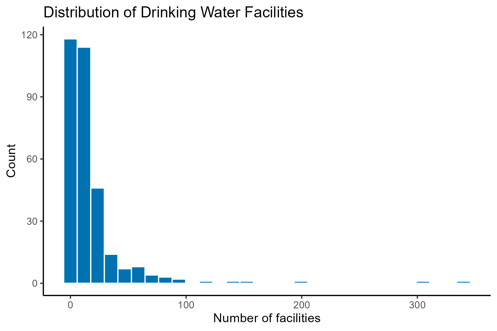
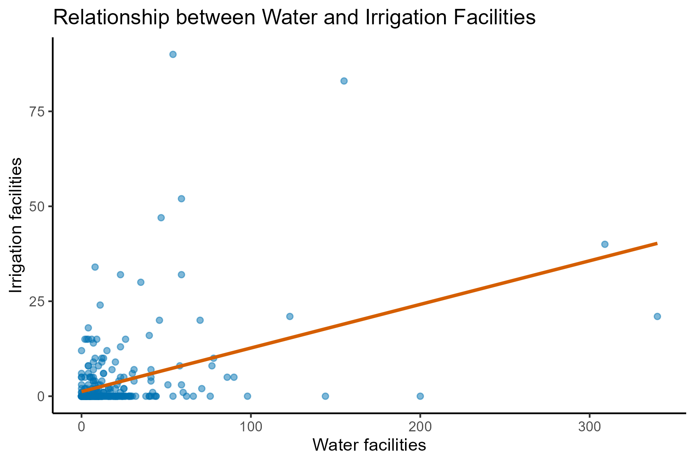

# Gender and Public Policy Impact: Experimental Evidence from India

This project examines whether female political leadership affects the allocation of local public goods using data from a randomized policy experiment in rural India.

The analysis is based on the field experiment by Chattopadhyay & Duflo (2004), where villages were randomly assigned a female or male council head.

The project has been independently reconstructed, extended, and implemented as a fully reproducible data analysis pipeline in R using simulated data.

This project contributes to a broader research agenda on inequality and institutions, examining how political representation shapes the allocation of public resources.

## Research Question

Does female political leadership change investment in local public goods such as drinking water and irrigation infrastructure?

## Data

- Unit of observation: villages
- Treatment: assignment of a female council head (female = 1)
- Outcomes:
  - number of drinking water facilities
  - number of irrigation facilities

Due to data usage restrictions, the original dataset is not included.  
A simulated dataset is provided to ensure full reproducibility of the analysis.


## Methodology

The analysis exploits a randomized experimental design to estimate the causal effect of female political leadership on public goods provision.

Because village leadership was randomly assigned, treatment is independent of both observed and unobserved characteristics. This allows differences in average outcomes between treated and control villages to be interpreted as the **average treatment effect (ATE)**.

Methods used:

- Difference-in-means estimator
- Linear regression (equivalent under random assignment)
- Descriptive statistics
- Correlation analysis
- Data visualization (histograms and scatter plots)

## Empirical Results

**Drinking water facilities:**
- Average (male-led villages): 14.74
- Average (female-led villages): 23.99
- Estimated effect: **+9.25 facilities**
- Statistically significant (p = 0.0197)

**Irrigation facilities:**
- Average (male-led villages): 3.39
- Average (female-led villages): 3.02
- Estimated effect: **−0.37 facilities**
- Not statistically significant

**Correlation:**
- Water and irrigation facilities: **0.41 (positive, moderate)**


## Visualizations

### Distribution of water facilities


### Relationship between water and irrigation



## Interpretation

- Female political leadership increases investment in drinking water infrastructure.
- No meaningful effect is observed for irrigation facilities.

- This suggests that leadership influences the **composition of public goods provision**, rather than uniformly increasing overall investment.

- **Internal validity:** Strong due to randomized assignment.
- **External validity:** Limited to similar institutional and geographic contexts.

## Ethical Considerations

This project raises important considerations in interpreting gender-based causal effects:
- **Avoiding overgeneralization:** Results are context-specific to rural India and should not be generalized to all political systems.
- **Interpretation of gender effects:** Differences in policy outcomes should not be interpreted as inherent gender differences, but as context-dependent institutional effects.
- **Policy sensitivity:** Findings relate to real-world governance and must be interpreted carefully to avoid reinforcing stereotypes.
- **Data simulation transparency:** Since original data cannot be redistributed, simulated data is used to preserve reproducibility while maintaining methodological structure.

## Limitations

- Results are specific to rural India and may not generalize to other institutional contexts.
- Outcomes focus on infrastructure provision and do not capture broader welfare impacts.
- The analysis does not explore mechanisms driving observed differences.


## Reproducibility

The project is fully reproducible using:

- `analysis.R` → full analytical pipeline
- `simulate_data.R` → synthetic dataset generation
- `theme.R` → shared visualization palette  

To reproduce results:

```r
source("simulate_data.R")
source("analysis.R")
```

## Project Structure

```text
02_gender_and_policy_impact/
│
├── analysis.R              # Main analysis script
├── simulate_data.R         # Synthetic data generation
├── india_simulated.csv     # Synthetic dataset 
├── figures/                # Generated plots
└── README.md
```


## Skills Demonstrated

- Causal inference using randomized experiments
- Difference-in-means estimation
- Data visualization in ggplot2
- Correlation analysis
- Data simulation for reproducibility
- Structured empirical research workflow in R


## Tools Used

- R
- ggplot2
- Base R statistical functions
