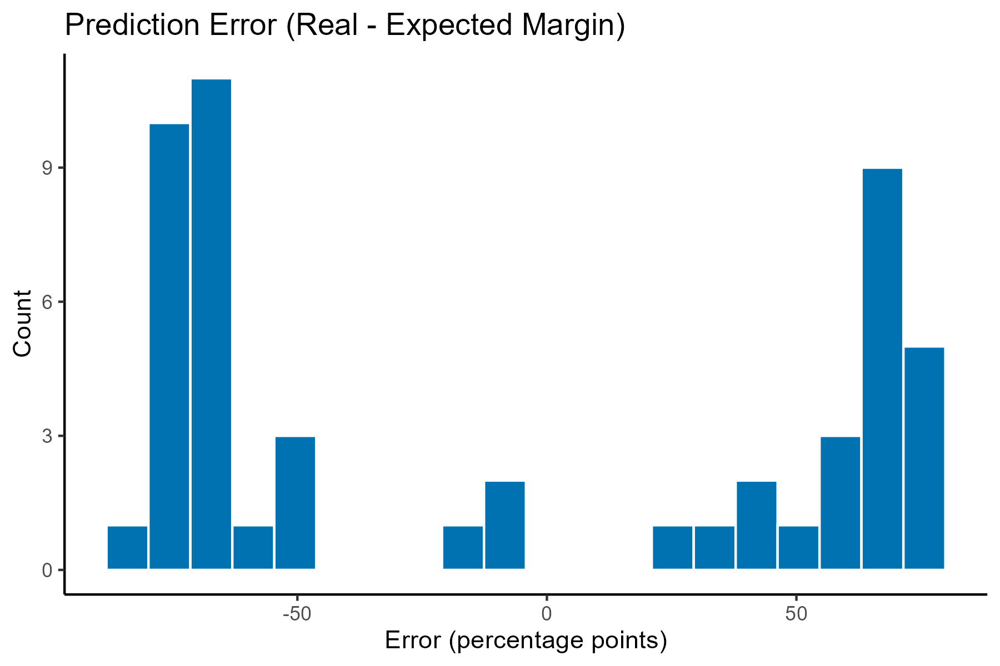
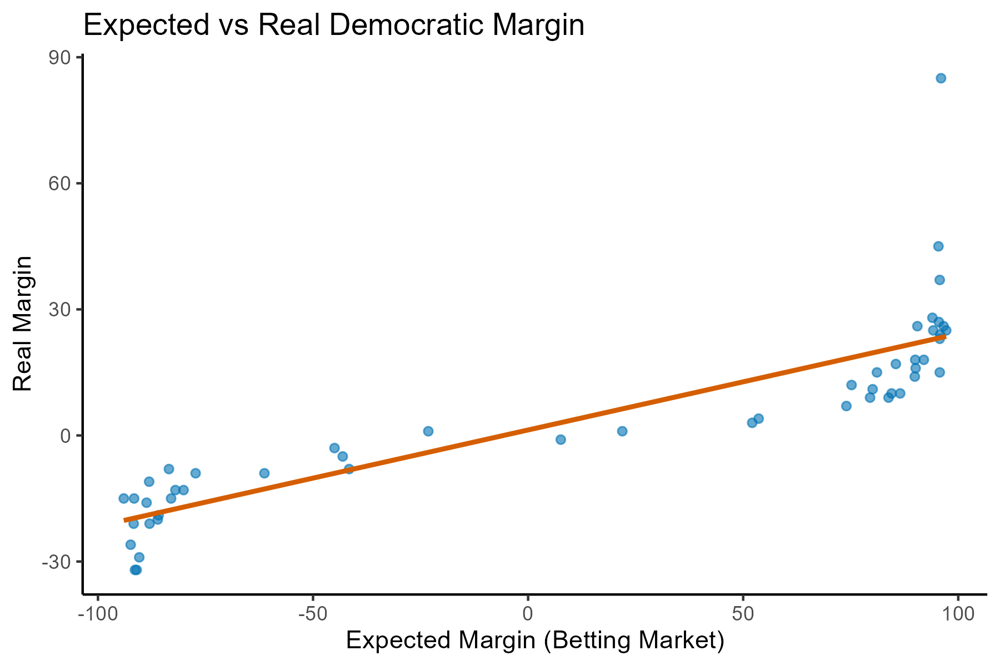

# Election Forecasting Using Betting Markets

This project analyzes whether betting markets can be used to predict electoral outcomes in the 2008 U.S. presidential election.

The analysis is based on state-level data comparing Intrade prediction markets with actual election results. Contracts traded on Intrade reflect the market’s expectation of each candidate’s vote share in a given state.

This project has been independently reconstructed and implemented as a fully reproducible data analysis pipeline in R using a synthetic dataset calibrated to the empirical model.


## Research Question

How accurately do betting markets predict electoral outcomes at the state level?

Can market-implied expectations be used as a reliable forecasting tool for election results?


## Data

- Unit of observation: U.S. states (plus DC)
- Key variables:
  - `D_expected`, `R_expected`: betting market-implied vote shares
  - `D_real`, `R_real`: actual vote shares in the 2008 election

Derived variables:
- `expected_margin = D_expected - R_expected`
- `real_margin = D_real - R_real`
- `error = real_margin - expected_margin`

The original dataset is not included due to usage restrictions.  
A synthetic dataset is provided that preserves the empirical structure of the original data.


## Methodology

This project uses a predictive modeling framework grounded in linear regression.

Main methods:

- Construction of market-based predictor (expected margin)
- Construction of observed outcome (real margin)
- Linear regression model: `real_margin ~ expected_margin`
- Correlation analysis
- Error analysis (prediction accuracy)
- R² as measure of predictive performance


## Empirical Strategy

The analysis evaluates the relationship between market expectations and realized electoral outcomes using a simple predictive model.

- If betting markets are efficient, expected margins should closely track real margins.
- This is evaluated through:
  - correlation strength
  - slope of regression line
  - prediction error distribution
  - explanatory power (R²)

The model can be interpreted as a simple forecasting function mapping market beliefs into realized outcomes.


## Empirical Results

- Betting market expectations are strongly correlated with actual electoral outcomes.  
  - Correlation: ~0.85

- The linear model shows strong predictive power:  
  - R²: ~0.73  
  - Suggesting that a large share of variation in election outcomes is captured by market expectations

- The estimated relationship is:  
  - real_margin ≈ 1.3 + 0.229 × expected_margin

- Prediction errors are non-trivial but centered around zero, indicating no strong systematic bias in the market predictions.

- Overall, betting markets provide a strong but imperfect forecasting signal for electoral outcomes.


## Visualizations

### Prediction error distribution


### Expected vs Real Electoral Margins



## Model Interpretation

- **Intercept (≈ 1.3):** baseline systematic bias in realized margins  
- **Slope (≈ 0.229):** degree to which market expectations translate into actual outcomes  
- **R² (≈ 0.73):** proportion of variance in real margins explained by market forecasts  

This suggests that markets are informative but not fully efficient predictors of election outcomes.


## Ethical Considerations

Although this project does not involve individual-level or sensitive data, several considerations are relevant in interpreting the results:
- **Market interpretation bias:** Betting markets reflect both information and speculation, and should not be interpreted as purely rational expectations.
- **Predictive limitations:** High predictive performance does not imply causal interpretation.
- **Overconfidence risk:** Strong R² values may overstate the reliability of forecasts beyond the studied election.
- **Data simulation transparency:** Synthetic data is used to preserve reproducibility while maintaining the structure of the original empirical model.


## Limitations

- Analysis is limited to a single election (2008 U.S. presidential election)
- State-level aggregation masks within-state heterogeneity
- Betting market prices may reflect both information and behavioral biases
- Synthetic data approximates but does not perfectly replicate original market dynamics


## Reproducibility

The project is fully reproducible using:

- `analysis.R` → full modeling and visualization pipeline  
- `simulate_data.R` → synthetic dataset generation
- `theme.R` → shared visualization palette    

The synthetic dataset is generated using a data-generating process calibrated to the estimated empirical model, preserving both coefficient structure and residual variance.

To reproduce results:

```r
source("simulate_data.R")
source("analysis.R")
```

## Project Structure

```text
03_election_behaviour_and_forecasting/
│
├── analysis.R              # Main analysis script
├── simulate_data.R         # Synthetic data generation
├── intrade_simulated.csv   # Synthetic dataset 
├── figures/                # Generated plots
└── README.md
```


## Skills Demonstrated

- Predictive modeling and forecasting
- Linear regression interpretation
- Correlation and error analysis
- Data simulation calibrated to empirical estimates
- Evaluation of predictive performance (R², residuals)
- Applied statistical learning workflow in R


## Tools Used

- R
- ggplot2
- Base R statistical modeling functions
