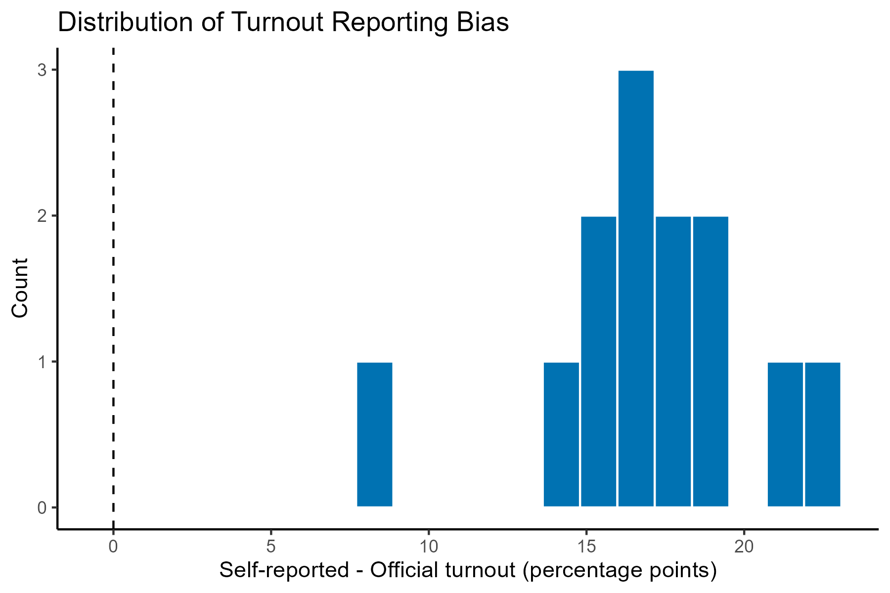
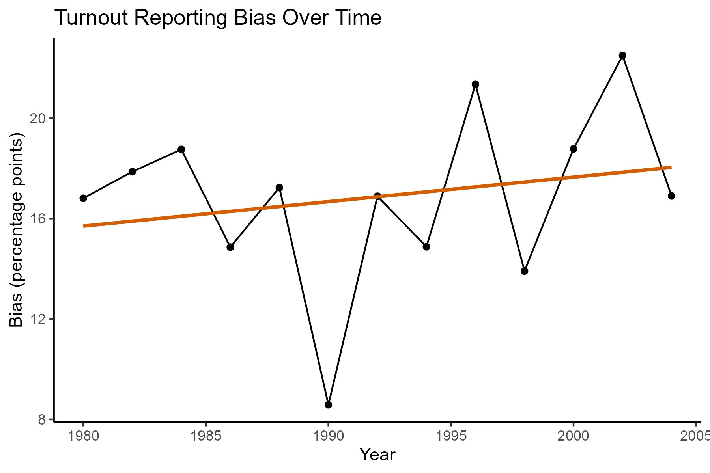

# Survey Bias and Voter Turnout (ANES 1980–2004)

This project examines the gap between self-reported voter turnout and officially measured turnout in U.S. federal elections using data from the American National Election Studies (ANES).

The analysis focuses on whether survey respondents systematically overreport voting behavior, and how this reporting bias varies across election types and over time.

This project is independently reconstructed and implemented as a fully reproducible data analysis pipeline in R using a simulated dataset that preserves the empirical structure of the original data.


## Research Question

Do survey respondents systematically overreport voter turnout in the United States?

How does self-reported turnout differ from official turnout across election types and over time?


## Data

- Unit of observation: U.S. federal elections (1980–2004)
- Observations: 13 elections

**Key variables:**
- `ANES_turnout`: self-reported turnout (survey data)
- `votes`: number of ballots cast (official count)
- `VEP`: voting eligible population
- `VAP`: voting age population
- `presidential`, `midterm`: election type indicators
- `felons`, `noncitizens`: population adjustments

**Derived variables:**
- `VEP_turnout = votes / VEP * 100`
- `VAP_turnout = votes / VAP * 100`
- `turnout_bias = ANES_turnout - VEP_turnout`

The original dataset is not included due to usage restrictions.  
A simulated dataset is provided to ensure full reproducibility.


## Methodology

The analysis is descriptive and inferential, focusing on measurement error in survey data.

**Main methods:**
- Construction of official turnout measures (VEP-based and VAP-based)
- Construction of self-reporting bias measure
- Mean comparisons across groups
- Histogram analysis of bias distribution
- Correlation analysis between bias and turnout
- Time trend analysis using linear regression
- Heterogeneity analysis by election type


## Empirical Strategy

The project evaluates whether self-reported turnout systematically deviates from official turnout measures.

- If survey responses are accurate, bias should be centered around zero.
- If respondents overreport turnout, bias should be positive on average.
- Differences across election types may reflect variation in social desirability pressure.


## Empirical Findings

- Self-reported turnout is consistently higher than official turnout.
  - Mean ANES turnout: **64.85%**
  - Mean VEP turnout: **47.98%**

- Average reporting bias:
  - Overall: **~16.9 percentage points**

- Bias is present in both election types:
  - Presidential elections: **~18.1 pp**
  - Midterm elections: **~15.4 pp**

- Bias distribution is concentrated above zero, indicating systematic overreporting.

- Correlation between bias and official turnout:
  - **~0.38**, suggesting moderate association

- Time trend analysis:
  - No statistically significant trend in bias over time
  - (slope ≈ 0.097, p ≈ 0.47)

Overall, results indicate persistent overreporting of turnout in survey data, with limited evidence of systematic change over time.


## Visualizations

### Distribution of turnout reporting bias


### Turnout reporting bias over time



## Interpretation

- Survey respondents systematically overreport voting behavior.
- This pattern is consistent with **social desirability bias**, where respondents report behavior perceived as socially approved.
- The gap between self-reported and official turnout highlights limitations of survey-based measurement of political participation.
- No strong evidence suggests that reporting bias is changing over time in this dataset.

## Ethical Considerations

- **Social desirability bias in surveys:** The analysis highlights how respondents may misreport sensitive or socially desirable behaviors such as voting. This raises broader concerns about the reliability of self-reported political data.
- **Interpretation of “lying”:** Overreporting turnout does not necessarily imply intentional deception. It may reflect memory errors, identity signaling, or perceived social expectations. Interpretations should therefore avoid moral judgments.
- **Use of survey data in research and policy:** Findings based on self-reported political behavior should account for systematic measurement error, especially when used in models of political participation or democratic engagement.
- **Transparency in data limitations:** Since the analysis relies on aggregated election-level data, individual-level mechanisms behind misreporting cannot be directly observed, which limits causal interpretation of behavior.

## Limitations

- Small sample size (13 elections) limits statistical power.
- Aggregated election-level data hides individual-level variation.
- Measurement error is inferred indirectly rather than observed directly.
- External validity depends on stability of survey behavior over time.


## Reproducibility

The project is fully reproducible using:

- `analysis.R` → full data processing, analysis, and visualization pipeline  
- `simulate_data.R` → synthetic dataset generation  
- `theme.R` → shared visualization palette  

The synthetic dataset is generated using a data-generating process calibrated to observed turnout measures, preserving structure and measurement relationships.

```r
source("simulate_data.R")
source("analysis.R")
```

## Project Structure

```text
04_survey_bias_and_turnout/
│
├── analysis.R              # Main analysis script
├── simulate_data.R         # Synthetic data generation
├── anes_simulated.csv   # Synthetic dataset 
├── figures/                # Generated plots
└── README.md
```


## Skills Demonstrated

- Measurement error analysis in survey data
- Construction of derived variables
- Descriptive statistical analysis
- Data visualization in ggplot2
- Correlation and trend analysis
- Linear regression interpretation
- Data simulation for reproducibility
- Applied survey methodology concepts


## Tools Used

- R
- tidyverse
- ggplot2
- Base R statistical functions