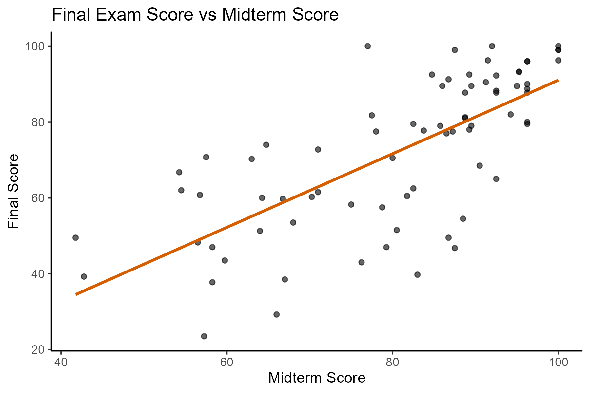
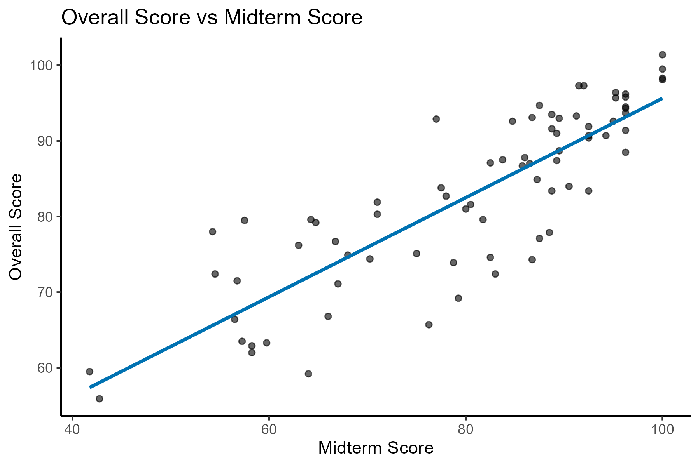
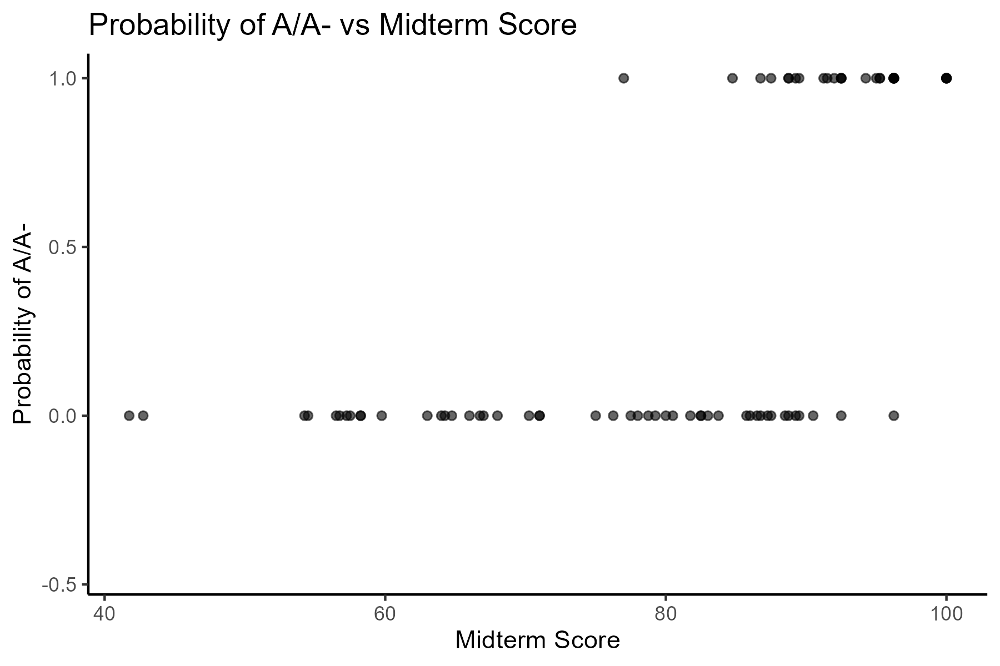

# Predicting Course Grades Using Midterm Scores

This project analyzes the relationship between students’ midterm performance and their final course outcomes using real historical classroom data.

The goal is to evaluate how well early performance (midterm exam) can predict later academic outcomes, including final exam scores, overall course grades, and the probability of earning an A or A-.

The analysis is fully reproducible and implemented in R using a simulated dataset that preserves the statistical structure of the original data.


## Research Questions

- How strongly does midterm performance predict final exam scores?
- Can midterm scores be used to predict overall course performance?
- How well do midterm scores predict the probability of earning an A or A-?


## Data

- Unit of observation: individual students  
- Observations: 76 students  

**Variables:**
- `midterm`: midterm exam score (0–100)
- `final`: final exam score (0–100)
- `overall`: overall course score (0–100)
- `gradeA`: indicator for earning an A or A- (1 = yes, 0 = no)

The original dataset is not included due to usage restrictions.  
A simulated dataset is provided to ensure full reproducibility.


## Methodology

The analysis uses simple linear models to evaluate predictive relationships between academic performance measures.

**Main methods:**
- Correlation analysis
- Linear regression (OLS)
- Linear Probability Model (binary outcome)
- Prediction using fitted values
- Model evaluation using R²
- Data visualization with scatter plots and regression lines


## Empirical Strategy

The project estimates three predictive models:

1. **Final exam score prediction**
   - `final ~ midterm`

2. **Overall course score prediction**
   - `overall ~ midterm`

3. **Probability of earning an A/A-**
   - `gradeA ~ midterm` (linear probability model)

The key assumption is that midterm performance contains meaningful signal about student ability and therefore can be used for prediction.


## Empirical Findings

### 1. Final exam performance
- Correlation (midterm–final): **0.72**
- R²: **0.51**
- Strong positive relationship between midterm and final exam performance

Interpretation:  
Midterm scores explain about half of the variation in final exam outcomes.


### 2. Overall course performance
- Correlation (midterm–overall): **0.85**
- R²: **0.72**
- Very strong predictive relationship

Interpretation:  
Midterm performance is a strong predictor of overall course success.


### 3. Probability of earning an A/A-
- Correlation (midterm–gradeA): **0.64**
- R²: **0.41**
- Moderate predictive relationship

Interpretation:  
Higher midterm scores increase the probability of earning an A/A-, but with substantial variability.


## Visualizations

### Final exam vs midterm


### Overall score vs midterm


### Probability of A/A- vs midterm



## Interpretation

- Midterm performance is a strong predictor of later academic outcomes.
- Predictive strength increases when moving from final exam → overall grade.
- Even simple linear models capture substantial variation in student performance.
- The relationship is strongest for continuous outcomes and weaker for binary classification.

A key takeaway is that early academic performance contains significant predictive signal, even without complex modeling techniques.


## Ethical Considerations

- **Risk of deterministic interpretation:** Predicting grades from early performance can lead to overly deterministic conclusions about student ability. These models describe statistical relationships, not fixed outcomes.
- **Measurement vs ability:** Exam scores reflect both ability and external factors (stress, preparation time, course difficulty). Predictions should not be interpreted as pure measures of talent.
- **Fairness concerns:** Using predictive models in educational settings may reinforce inequalities if used for tracking or early labeling of students.
- **Binary outcome limitations:** The linear probability model used for `gradeA` can produce values outside [0,1], highlighting limitations of simple linear methods for classification.
- **Responsible use:** These models should be interpreted as descriptive and predictive tools, not decision-making systems.


## Limitations

- Small sample size (76 students)
- Linear models assume constant relationships
- No causal interpretation (purely predictive)
- Binary outcome modeled with linear probability model (not logistic regression)
- Results depend on exam design and grading structure


## Reproducibility

The project is fully reproducible using:

- `analysis.R` → full modeling and visualization pipeline  
- `simulate_data.R` → synthetic dataset generation
- `theme.R` → shared visualization palette    

The simulated dataset is calibrated to reproduce:
- observed correlations
- regression slopes
- variance structure of outcomes

To reproduce results:

```r
source("simulate_data.R")
source("analysis.R")
```

## Project Structure

```text
05_grade_prediction_models/
│
├── analysis.R              # Main analysis script
├── simulate_data.R         # Synthetic data generation
├── grades_simulated.csv      # Synthetic dataset 
├── figures/                # Generated plots
└── README.md
```

## Skills Demonstrated

- Predictive modeling with linear regression
- Linear probability models
- Correlation and variance interpretation
- Model evaluation using R²
- Data visualization in ggplot2
- Data simulation for reproducibility
- Applied statistical reasoning in education data


## Tools Used

- R
- tidyverse
- ggplot2
- base R statistical functions