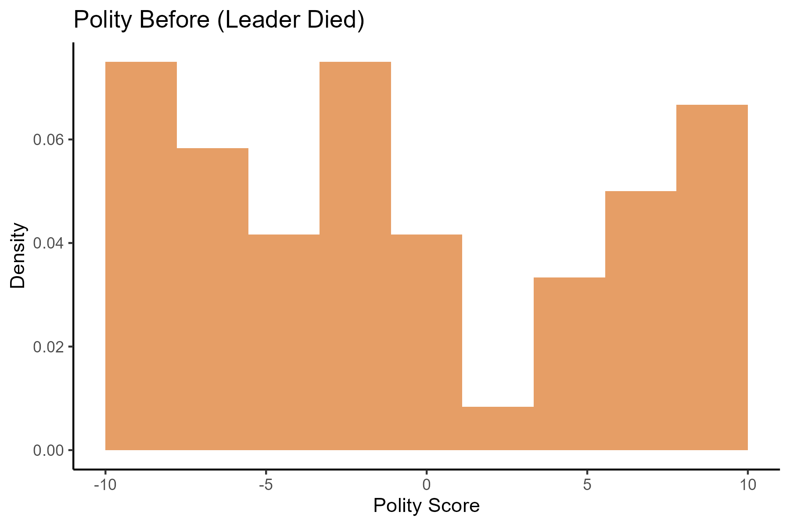
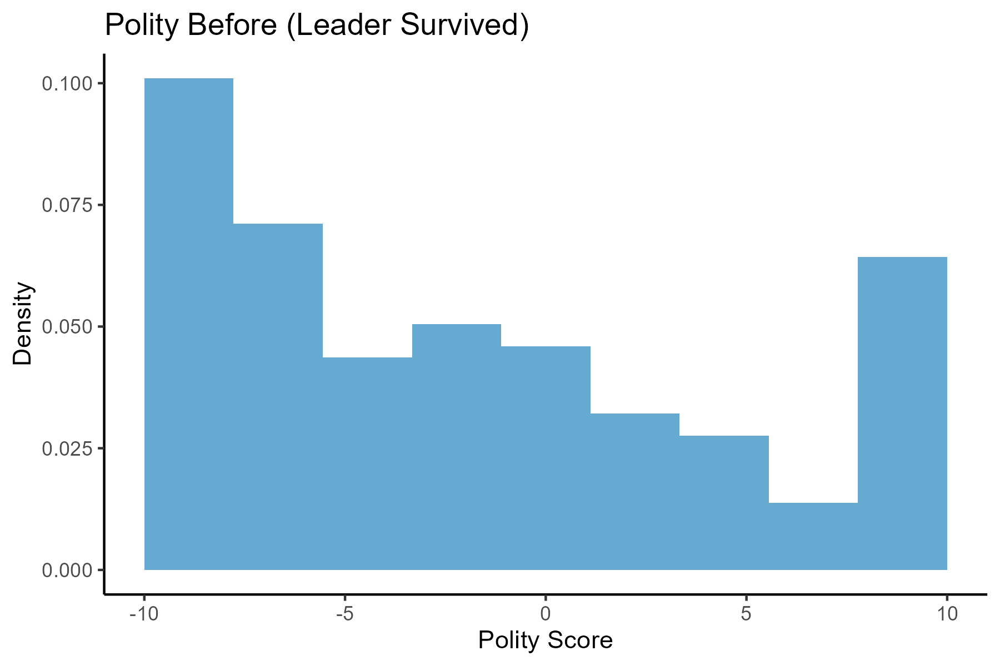
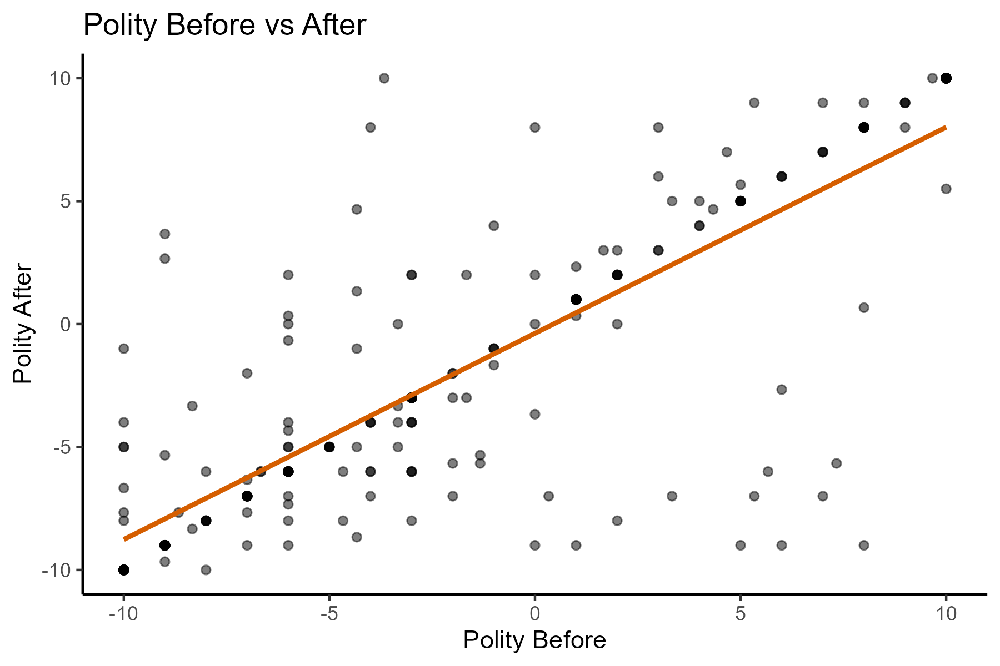

# Leader Death and Democracy: Evidence from Assassination Attempts (1875–2004)

This project examines whether the death of political leaders during assassination attempts has a measurable effect on a country’s level of democracy.

The analysis is based on the influential study by Jones & Olken (2009), *“Hit or Miss? The Effect of Assassinations on Institutions and War”*, which investigates whether individual political leaders causally shape institutional outcomes.

The project reconstructs and extends the empirical analysis in a fully reproducible R workflow using both original and simulated data.


## Research Question

Does the death of a political leader lead to changes in a country’s level of democracy?

More specifically:

→  What is the causal effect of leader death (treatment) on post-assassination polity scores (outcome)?


## Data

- **Unit of observation:** assassination attempts against political leaders
- **Time period:** 1875–2004
- **Number of observations:** 250

### Variables

- `year`: year of assassination attempt  
- `country`: country where attempt took place  
- `leadername`: name of political leader  
- `died`: treatment indicator (1 = leader died, 0 = survived)  
- `politybefore`: democracy score before attempt (-10 to +10)  
- `polityafter`: democracy score after attempt (-10 to +10)  

### Data availability

Due to usage restrictions, the original dataset is not included in the repository.

A simulated dataset is provided to ensure full reproducibility of the analysis.

The synthetic dataset preserves key statistical properties of the original:
- Sample size and treatment rate
- Distribution of polity scores
- Strong persistence over time
- Confounding between treatment and baseline democracy

## Methodology

This project uses a **causal inference framework for observational data**, combining descriptive statistics, visualization, and linear modeling.

### Key identifying assumption

→  Conditional on an assassination attempt occurring, the death of the leader is as-good-as-random.

This assumption allows estimation of the **average treatment effect (ATE)** using:

- Difference-in-means estimator  
- Linear regression (equivalent under binary treatment)  
- Multivariate regression controlling for baseline democracy  


### Methods used

- Summary statistics and frequency tables  
- Density histograms  
- Scatter plots with linear smoothing  
- Correlation analysis  
- Difference-in-means estimator  
- Ordinary Least Squares (OLS) regression  


## Empirical Results

### Descriptive statistics

- Total assassination attempts: **250**
- Leader death rate: **21.6%**

### Treatment effect (naive)

- Average polity change differs between treated and control groups  
- Estimated difference-in-means effect:  
  **+1.13 polity points**

### Regression results

#### Simple model

$$
polity after = \alpha + \beta \cdot died
$$

- Estimated effect of leader death: **+1.13**
- Not statistically significant (p ≈ 0.26)

#### Controlled model

$$
polity after = \alpha + \beta_1 \cdot died + \beta_2 \cdot polity before
$$

- Effect of leader death (β₁): **+0.26**
- Effect of baseline democracy (β₂): **0.84**
- Model explains substantial variation in outcomes (**R² ≈ 0.69**)


### Key finding

- The naive estimate suggests a positive effect of leader death on democracy.
- After controlling for baseline democracy, the effect shrinks substantially.
- This indicates **confounding by pre-existing regime type**.


## Visualizations

### Distribution of baseline democracy (by treatment status)

We compare the distribution of pre-treatment democracy (politybefore) between countries where leaders were killed and those where leaders survived.

This provides evidence on whether treatment assignment is conditionally random.





---

### Relationship between pre- and post-assassination democracy

We examine the relationship between democracy before and after assassination attempts.

The strong positive association suggests high persistence in institutional quality over time.

Correlation: **0.83**




## Interpretation

- Leader deaths are not robustly associated with changes in democracy once baseline regime type is controlled for.
- The initial positive association is largely explained by pre-existing differences in regime type rather than a causal effect of leader death.
- Democracy levels are highly **persistent over time**


## Substantive conclusion

The findings suggest that institutional outcomes (democracy levels) are **not strongly driven by individual leader deaths**, but instead reflect long-run structural characteristics of political systems.


## Ethical Considerations

- **Interpretation of political violence:** The analysis uses assassination attempts as exogenous shocks for causal inference. This is a statistical modeling assumption and should not be interpreted as normalizing or justifying political violence.
- **Causal interpretation limits:** Estimated effects of leader death on democracy are conditional on strong identification assumptions and should not be read as definitive causal truths.
- **Use of institutional measures:** Polity scores are constructed indices of democracy and do not fully capture the complexity of political institutions. Results should therefore be interpreted as approximate.
- **Historical sensitivity:** The dataset includes real historical events involving political instability and loss of life. Findings should be presented in a neutral and non-normative manner.
- **Replication and transparency:** The project is fully reproducible through simulated data due to restricted access to the original dataset, ensuring transparency while respecting data usage constraints.


## Limitations

- Observational nature of data (non-random assignment of assassination attempts)
- Strong reliance on conditional randomness assumption
- Potential unobserved confounders beyond baseline democracy
- Outcome restricted to short-term democracy changes


## Reproducibility

This project is fully reproducible using:

- `analysis.R` → full empirical workflow  
- `simulate_data.R` → synthetic data generation  
- `theme.R` → shared visualization palette  

To reproduce results:

```r
source("simulate_data.R")
source("analysis.R")
```

## Project Structure

```text
06_leader_death_and_democracy/
│
├── analysis.R              # Main analysis script
├── simulate_data.R         # Synthetic data generation
├── leaders_simulated.csv   # Synthetic dataset 
├── figures/                # Generated plots
└── README.md
```


## Skills Demonstrated

- Causal inference with observational data
- Difference-in-means estimation
- Linear regression interpretation
- Confounding and bias analysis
- Data visualization using ggplot2
- Data simulation for reproducibility
- Structured empirical research workflow in R


## Tools Used

- R
- tidyverse
- ggplot2
- Base R statistics
