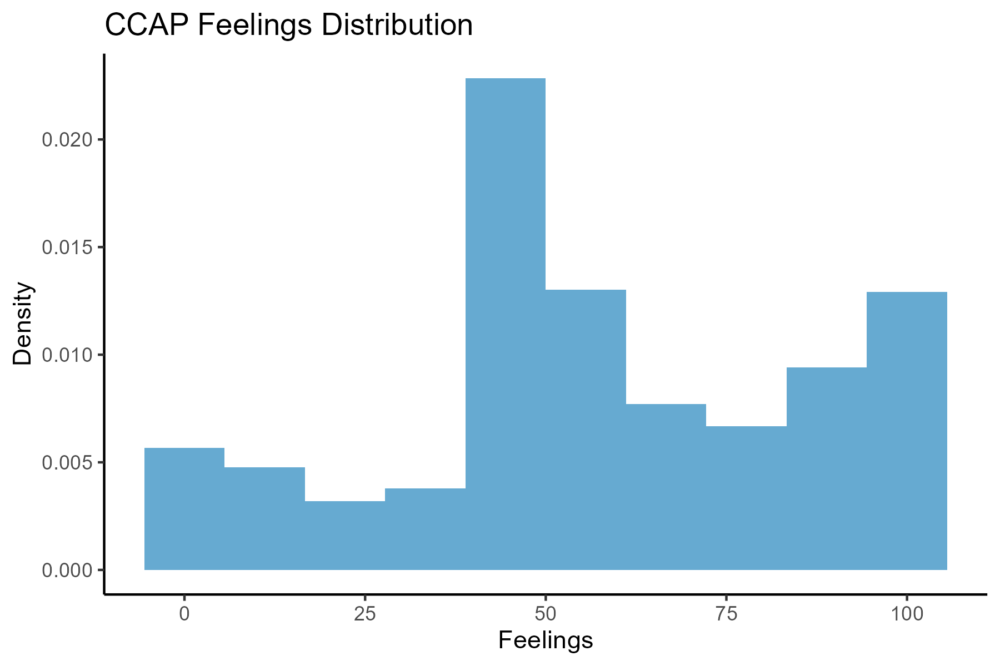
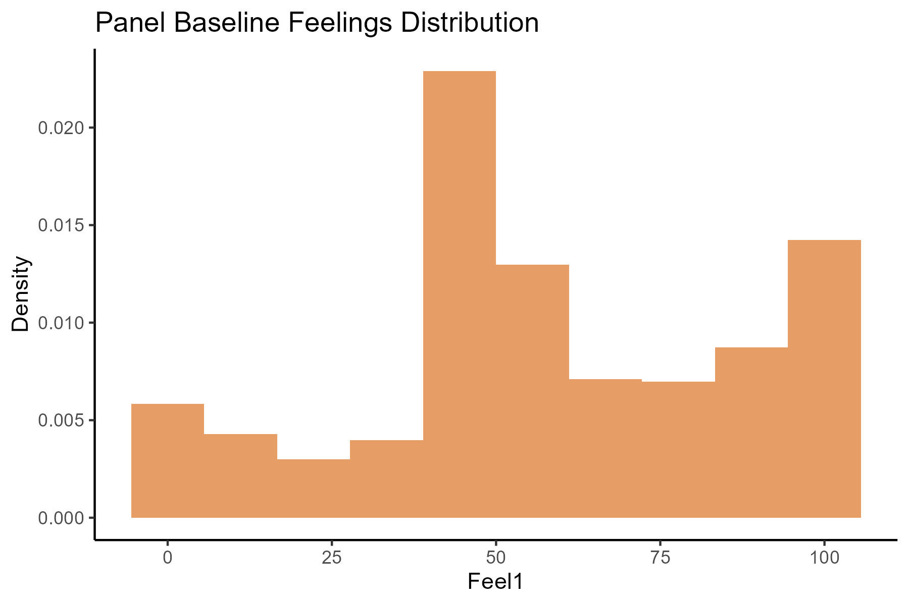
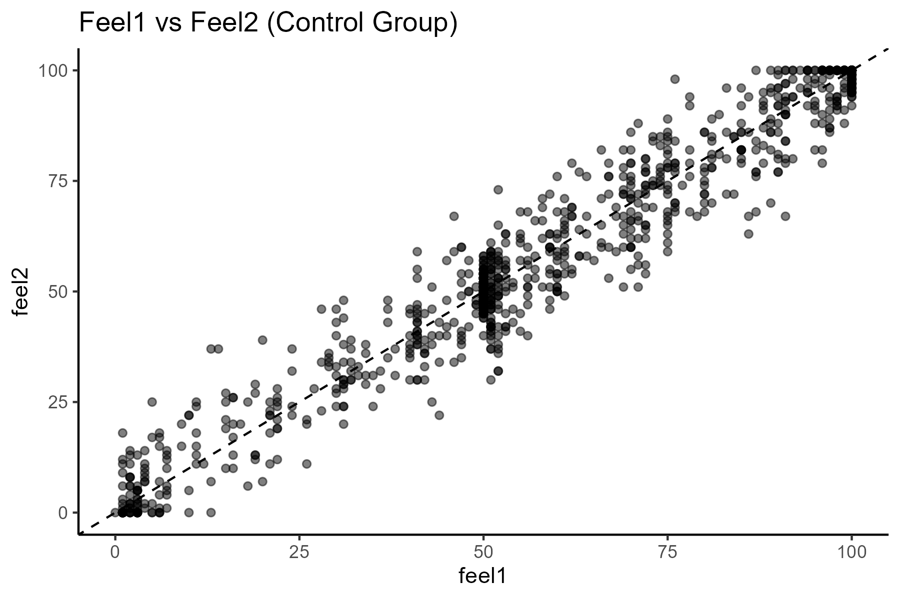
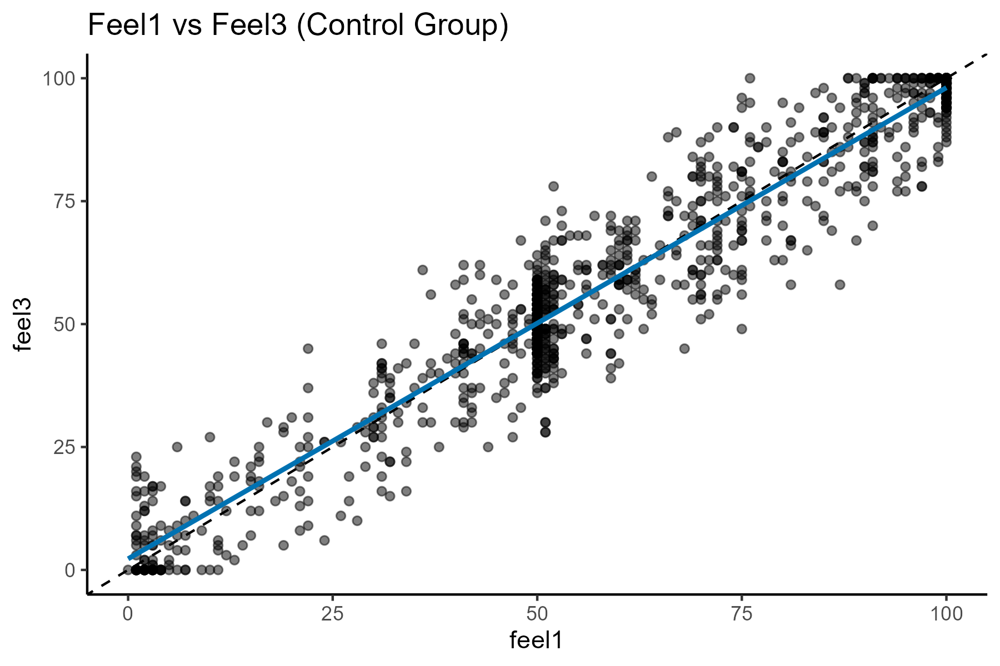
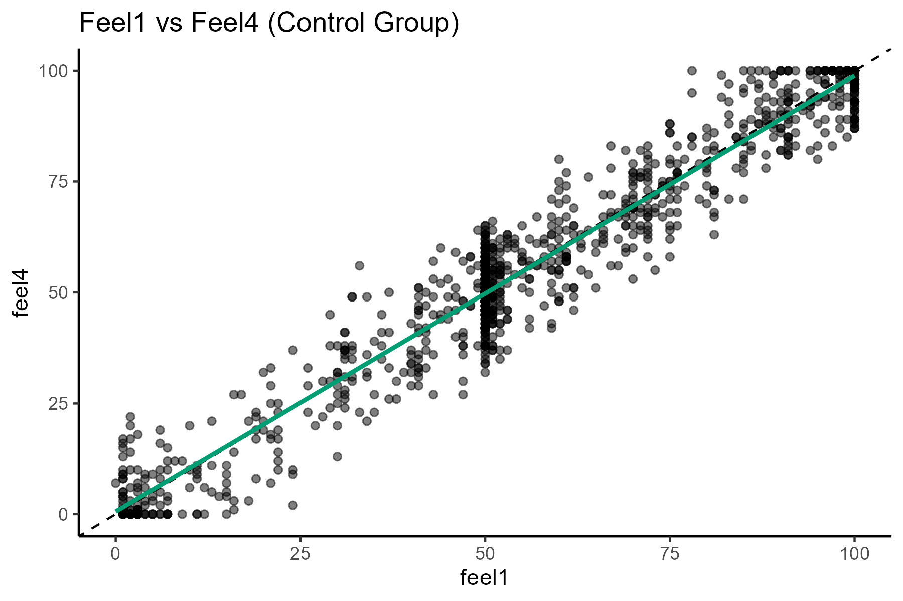

# Investigating Data Irregularities in Survey Experiments

This project examines statistical irregularities in a high-profile field experiment originally reported by LaCour and Green (2014), which claimed that brief interpersonal conversations could produce large and persistent changes in attitudes toward same-sex marriage.

These findings were later challenged by Broockman, Kalla, and Aronow (2014), who documented patterns in the data suggesting that it may not have been collected as described.

This case became a well-known example in discussions of the replication crisis and research transparency in social science.

This project reconstructs key elements of that critique using a fully reproducible R pipeline and simulated data.


## Research Question

Do the statistical properties of the experimental dataset resemble patterns that would be expected from real survey data, or do they exhibit signs consistent with artificially generated data?


## Data

Two datasets are used:

### 1. Experimental Panel Data
- Unit of observation: survey respondents  
- Observations: 2,441  

**Variables:**
- `treatment`: experimental assignment (five groups)
- `feel1`: baseline attitudes (0–100 scale)
- `feel2`: attitudes after 3 weeks
- `feel3`: attitudes after 6 weeks
- `feel4`: attitudes after 9 months  

### 2. Reference Survey Data (CCAP)
- Unit of observation: U.S. voters  
- Observations: ~44,000  

**Variable:**
- `feel`: attitudes toward gay men and lesbians (0–100 scale)

The original datasets are not included due to usage restrictions.  
Synthetic datasets are generated to preserve the empirical structure and ensure full reproducibility.


## Methodology

The analysis focuses on detecting statistical irregularities using descriptive and comparative methods.

**Main steps:**
- Comparison of distributions (density histograms)
- Summary statistics (mean, median, standard deviation)
- Visual inspection of baseline similarity
- Panel stability analysis using scatter plots
- Correlation analysis across survey waves
- Simulation of data-generating processes


## Empirical Strategy

The project evaluates two key diagnostics:

### 1. Distributional Similarity
If the experimental baseline data were genuinely collected from a local population (Los Angeles County), its distribution should differ from a national survey sample.

- If distributions are nearly identical → potential red flag  

### 2. Stability Over Time
In real panel surveys, attitudes typically exhibit variation due to:
- measurement error
- respondent inconsistency
- genuine opinion change  

- If responses remain almost perfectly stable → unusual pattern  

To test this, the project compares:
- `feel1` vs `feel2`
- `feel1` vs `feel3`
- `feel1` vs `feel4`  

and computes correlations across waves.


## Empirical Findings

### Distribution Comparison
- Mean (CCAP): **~58.1**
- Mean (Panel baseline): **~58.6**
- Medians: identical (**52**)
- Standard deviations: nearly identical (**~28.4–28.6**)

→ The two distributions are **strikingly similar**


### Stability Over Time (Control Group)

Correlation coefficients:

- 3 weeks: **0.97**
- 6 weeks: **0.96**
- 9 months: **0.97**

→ Attitudes appear **extremely stable over time**


### Interpretation of Patterns

- Baseline data closely matches an external dataset  
- Attitudes show unusually high persistence across long time periods  
- Observed patterns are consistent with:
  - sampling from an existing dataset
  - adding small random noise over time  


## Simulation Evidence

A synthetic data-generating process reproduces these patterns by:

1. Sampling baseline attitudes from a reference distribution  
2. Adding small random noise to generate follow-up waves  

This simple mechanism is sufficient to generate:
- nearly identical baseline distributions  
- extremely high correlations across time  

→ Suggesting that the observed patterns can arise without real survey collection.


## Visualizations

### Baseline Distribution Comparison




### Stability Over Time (Control Group)







## Interpretation

- The similarity between baseline distributions is unlikely under independent data collection from different populations.  
- The extremely high stability of attitudes over time is atypical for panel survey data.  
- Together, these patterns are consistent with a simple data-generating process rather than independently collected survey responses.  

This analysis does not directly prove misconduct but demonstrates that the observed data exhibit characteristics that warrant scrutiny.


## Ethical Considerations

- **Replication and scientific integrity:** The project highlights the importance of transparency and reproducibility in empirical research.  
- **Interpretation of irregularities:** Statistical anomalies do not, on their own, constitute proof of misconduct. Conclusions should remain cautious and evidence-based.  
- **Use of simulated data:** Synthetic datasets are used to preserve reproducibility while respecting data access restrictions.  
- **Sensitivity of topic:** Attitudes toward marginalized groups are socially and politically sensitive; analysis should avoid normative judgments about respondents.


## Limitations

- The analysis is descriptive and does not establish causal mechanisms.  
- Simulated data approximate, but do not replicate, the original datasets.  
- Individual-level behavioral explanations cannot be directly tested.  
- Results rely on stylized assumptions about expected survey variation.


## Reproducibility

The project is fully reproducible using:

- `analysis.R` → complete analysis and visualization pipeline  
- `simulate_data.R` → synthetic data generation 
- `theme.R` → shared visualization palette  

The simulated data preserve key distributional and temporal properties of the original datasets.

To reproduce results:

```r
source("simulate_data.R")
source("analysis.R")
```

## Project Structure

```text
07_replication_crisis_case_study/
│
├── analysis.R              # Main analysis script
├── simulate_data.R         # Synthetic data generation
├── ccap_simulated.csv      # Synthetic ccap dataset 
├── panel_simulated.csv     # Synthetic panel dataset 
├── figures/                # Generated plots
└── README.md
```

## Skills Demonstrated

- Detection of data irregularities  
- Distribution comparison and statistical diagnostics  
- Panel data analysis  
- Correlation and stability analysis  
- Data visualization with ggplot2  
- Simulation of data-generating processes  
- Reproducible research workflows  
- Applied research critique and interpretation  


## Tools Used

- R  
- tidyverse  
- ggplot2  
- Base R statistical functions  