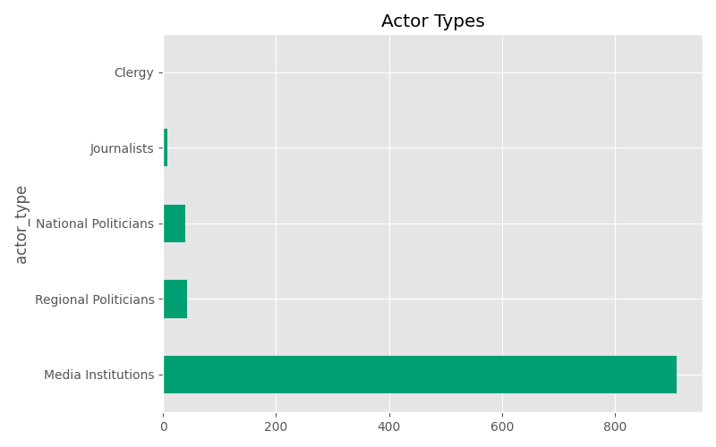
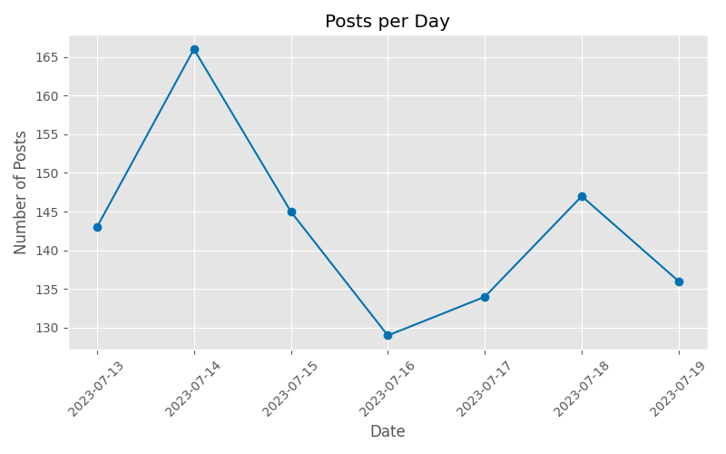
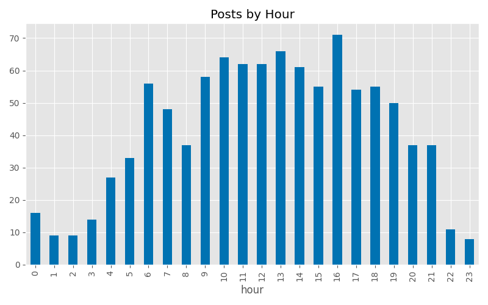

# Digital Democracy and Social Media Activity (Poland Elections 2023)

This project presents an exploratory analysis of 1,000 social media posts related to the 2023 Polish elections. The dataset captures public communication activity across different actor types, including media organisations, politicians, and journalists.

The goal is to identify structural patterns in online political communication relevant to digital democracy, information flow, and actor visibility.

The analysis focuses on:
- temporal posting patterns
- actor-level differences in activity
- content characteristics
- potential signals of coordination

The analysis is purely descriptive and does not aim to establish causal relationships.


## Research Questions

- How is posting activity distributed across different actor types?
- What temporal patterns characterize social media communication during the election period?
- Are there indications of coordination or content repetition?
- How do communication patterns differ across actor types?


## Data

- Unit of observation: individual social media posts  
- Observations: 1,000 posts  

**Key variables:**
- `username` – account identifier  
- `actor_type` – institutional category (e.g. media, politicians, journalists)  
- `post` – textual content  
- `datetime` – timestamp of publication  

The original dataset is not included due to usage restrictions.  

## Methodology

The analysis follows an exploratory data analysis (EDA) approach combining descriptive statistics, temporal analysis, and basic text mining.

**Methods used:**
- Frequency analysis (users, actor types, time patterns)
- Time series aggregation (daily, weekly, hourly trends)
- Grouped behavioural analysis by actor type
- Keyword extraction using stopword filtering
- Simple heuristic detection of low-information content
- Exact-text matching for coordination signals


## Key Findings

### Actor landscape

- Activity is highly concentrated among a small number of media organisations.
- Media actors account for the vast majority of posts, followed by political actors and journalists.
- Actor distribution is strongly imbalanced, suggesting unequal visibility in the dataset.

### Temporal patterns

- Posting activity shows a clear peak on specific days, with moderate fluctuations over time.
- Weekday patterns are relatively stable, with slightly lower activity on weekends.
- A strong diurnal cycle is observed, peaking in the afternoon (~16:00).

### Actor-specific behaviour

- Media organisations dominate across all time periods and follow structured daily rhythms.
- Political actors exhibit lower and more dispersed activity.
- No strong temporal divergence is observed beyond differences in volume.

### Coordination signals

- No evidence of exact-text repetition across multiple users within short time windows.
- However, this does not exclude more subtle forms of coordination such as paraphrasing or framing alignment.

### Content characteristics

- A small proportion of posts exhibit low-information or repetitive linguistic patterns.
- Differences across actor types suggest variation in communication style.


## Visualizations

The analysis includes the following figures:

- Distribution of top accounts  
- Actor type distribution  
- Daily posting activity  
- Weekly posting patterns  
- Hourly activity distribution  
- Actor-specific temporal heatmap  
- Low-information content share  

All figures are stored in the `figures/` directory.

### Key Figures

#### Actor distribution


#### Posting activity over time


#### Hourly activity pattern



## Interpretation

The results suggest a communication environment characterized by:

- Strong concentration of content production among institutional media actors  
- Structured temporal rhythms consistent with editorial publishing cycles  
- Uneven distribution of visibility across actor types  

From a digital democracy perspective, these patterns highlight how agenda-setting capacity may be concentrated among a small number of high-volume actors.  

However, all findings are descriptive and should not be interpreted as evidence of manipulation or coordinated behaviour.


## Ethical Considerations

- **Data interpretation:** Observed patterns do not imply malicious intent or coordinated manipulation  
- **Representation risk:** Aggregated analysis may obscure heterogeneity within actor groups  
- **Context sensitivity:** Findings should not be generalized beyond the studied political and temporal context  
- **Information integrity framing:** Results relate to structural communication patterns, not individual behaviour assessment  


## Limitations

- Data is limited to Poland’s 2023 election period and cannot be generalized broadly  
- Only textual data is included; multimedia content is excluded  
- Only exact-text matching is used, which misses paraphrased coordination  
- Predefined categories may oversimplify heterogeneous actors  
- No causal inference is attempted or possible


## Future Work

Possible extensions of this analysis include:

- Semantic similarity analysis for paraphrased coordination detection  
- Sentiment analysis of political communication  
- Network-based models of information diffusion  
- Cross-platform comparisons of election communication ecosystems  
- Bot or automation detection methods


## Code Availability

All analysis is fully reproducible from the provided Python scripts.  
The dataset is not included due to usage restrictions.


## Project Structure

```text
08_digital_democracy_analysis/
│
├── analysis.py              # Main Python analysis script
├── analysis.ipynb           # Notebook
├── report.pdf               # LaTeX report (work in progress)
├── readme.md                # Project overview
│
├── figures/                 # Generated plots
│
└── requirements.txt         # Python dependencies
```

## Skills Demonstrated

- Exploratory data analysis (EDA)
- Temporal data analysis
- Social media analytics
- Basic NLP (tokenization, stopword removal, frequency analysis)
- Data visualization (matplotlib, seaborn)
- Data quality checks
- Communication of analytical findings
- Ethical framing of data analysis


## Tools Used

- Python
- pandas
- matplotlib
- seaborn
- scikit-learn (stopwords)
